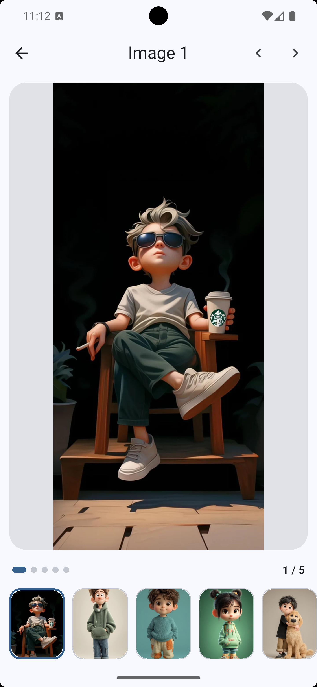
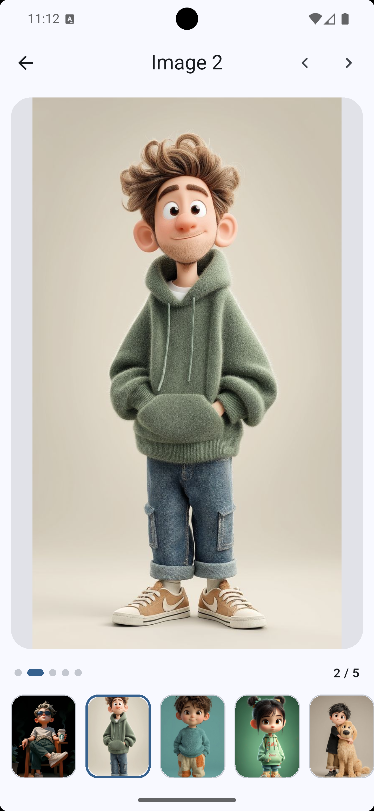
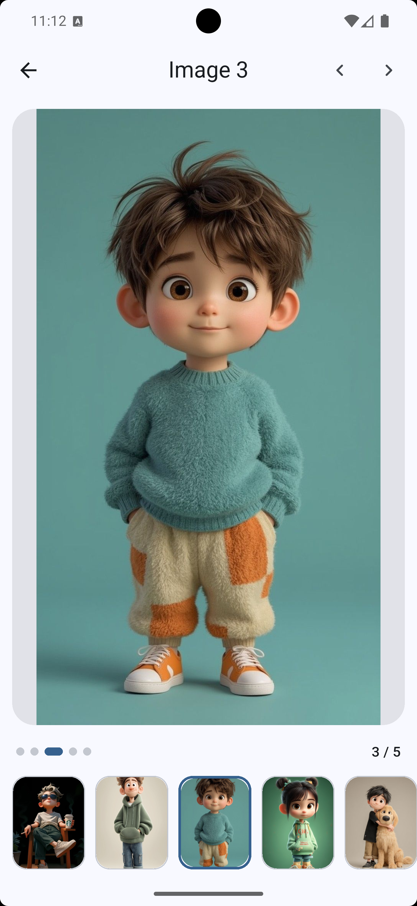
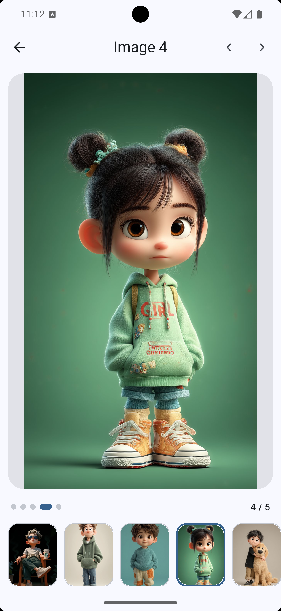
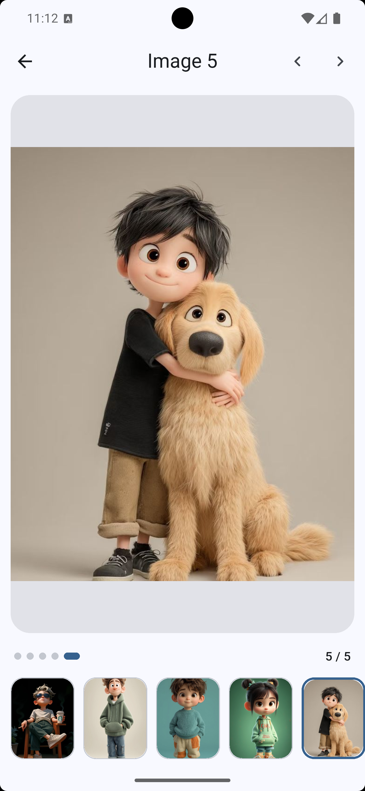

# Image Viewer App

A modern, feature-rich image viewing application built with Flutter. This app provides a seamless image browsing experience with gallery and full-screen viewing modes.

## 📱 Screenshots

<p align="center">
  
  
  
  
</p>

<p align="center">
  
  
</p>

## 🌟 Features

- **Dual View Modes**: Switch between gallery view and full-screen viewer
- **Interactive Viewer**: Pinch-to-zoom functionality for detailed image inspection
- **Gesture Navigation**: Intuitive swipe gestures to navigate between images
- **Thumbnail Gallery**: Grid-based thumbnail view for quick image selection
- **Pagination Controls**: Dots indicator and navigation buttons for easy browsing
- **Responsive Design**: Optimized for all screen sizes and orientations
- **Dark/Light Theme**: Automatic theme switching based on system preferences
- **Error Handling**: Graceful handling of missing images with fallback UI
- **Smooth Animations**: Hero transitions and animated UI elements
- **Material Design 3**: Modern UI following latest design guidelines

## 🛠️ Technologies & Packages

### Core Technologies
- **Flutter**: Cross-platform mobile development framework
- **Dart**: Programming language for Flutter

### Key Packages
- **image**: ^4.7.2 - Image processing and manipulation
- **Material Design 3**: Built-in Material 3 design system
- **InteractiveViewer**: Built-in Flutter widget for zooming
- **Hero Animations**: Built-in Flutter navigation animations
- **ColorScheme.fromSeed**: Dynamic theming based on seed color

## 🏗️ Architecture

The app follows a feature-based architecture with clear separation of concerns:

```
lib/
├── core/                   # Shared logic and utilities
│   ├── constants/          # App constants
│   └── theme/              # App styling and themes
└── features/               # Feature-based modules
    └── gallery/            # Gallery feature
        └── presentation/   # UI layer
            ├── screens/    # View screens
            │   ├── gallery_screen.dart    # Thumbnail grid view
            │   └── viewer_screen.dart     # Full-screen swipe viewer
            └── widgets/    # Reusable UI components
                ├── dots_indicator.dart      # Pagination indicator
                ├── gallery_tile.dart        # Thumbnail tile component
                └── image_missing_full.dart  # Missing image placeholder
```

## 🔄 App Flow

```mermaid
graph TD
    A[Main App] --> B{User Action}
    B -->|View Gallery| C[Gallery Screen]
    B -->|Direct View| D[Viewer Screen]
    C --> E[Select Image]
    E --> D
    D --> F[Swipe Navigation]
    F --> G[Next Image] | H[Previous Image]
    D --> I[Zoom with Pinch]
    D --> J[Return to Gallery]
    J --> C
```

## 🎨 UI/UX Design

### Color Palette
- **Primary Blue**: Dynamic color scheme based on seed color
- **Surface Colors**: Material 3 surface variants
- **Background**: Light/dark theme support
- **Accent Colors**: Based on system theme preferences

### Typography
- **Material Design 3**: Default Flutter typography
- **Dynamic Scaling**: Responsive text sizing
- **Accessibility**: High contrast text elements

## 🚀 Getting Started

### Prerequisites
- Flutter SDK (3.10.0 or higher)
- Dart SDK
- Android Studio or VS Code

### Installation

1. Clone the repository:
   ```bash
   git clone https://github.com/your-username/image_viewer_app.git
   ```

2. Navigate to the project directory:
   ```bash
   cd image_viewer_app
   ```

3. Install dependencies:
   ```bash
   flutter pub get
   ```

4. Add your images to the `assets/images/` folder

5. Run the app:
   ```bash
   flutter run
   ```

## 📁 Project Structure

The app follows a feature-first architecture where the gallery functionality is organized in its own directory:

```
features/
├── gallery/                # Gallery feature
│   └── presentation/       # UI layer
│       ├── screens/        # View screens
│       │   ├── gallery_screen.dart    # Grid view of images
│       │   └── viewer_screen.dart     # Full-screen swipe viewer
│       └── widgets/        # Reusable UI components
│           ├── dots_indicator.dart      # Pagination indicator
│           ├── gallery_tile.dart        # Thumbnail tile with error handling
│           └── image_missing_full.dart  # Missing image placeholder
```

## 🖼️ Image Management

The app uses local asset images for fast loading:

- **Supported Formats**: JPG, PNG, GIF, WebP, and other common formats
- **Location**: Images stored in `assets/images/` folder
- **Configuration**: Image paths defined in `lib/core/constants/image_paths.dart`
- **Caching**: Flutter's built-in image caching system

## 📱 Responsive Design

The app is designed to work on multiple platforms:
- **Mobile**: Primary target platform
- **Tablet**: Optimized layouts for larger screens
- **Desktop**: Experimental support for desktop platforms
- **Web**: Browser-based version

## 🧪 Testing

The app includes:
- Unit tests for business logic
- Widget tests for UI components
- Integration tests for critical user flows

To run tests:
```bash
flutter test
```

## 🤝 Contributing

1. Fork the repository
2. Create a feature branch (`git checkout -b feature/AmazingFeature`)
3. Commit your changes (`git commit -m 'Add some AmazingFeature'`)
4. Push to the branch (`git push origin feature/AmazingFeature`)
5. Open a pull request

## 📄 License

This project is licensed under the MIT License - see the [LICENSE](LICENSE) file for details.

## 🙏 Acknowledgements

- [Flutter](https://flutter.dev/)
- [Material Design](https://material.io/)
- [Dart](https://dart.dev/)