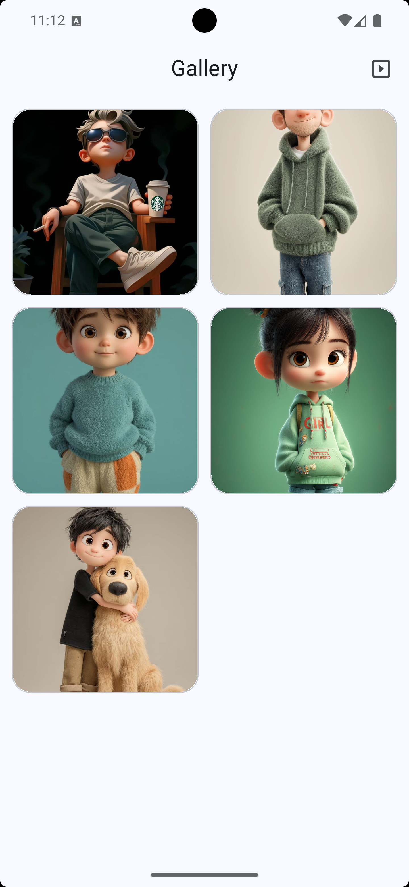
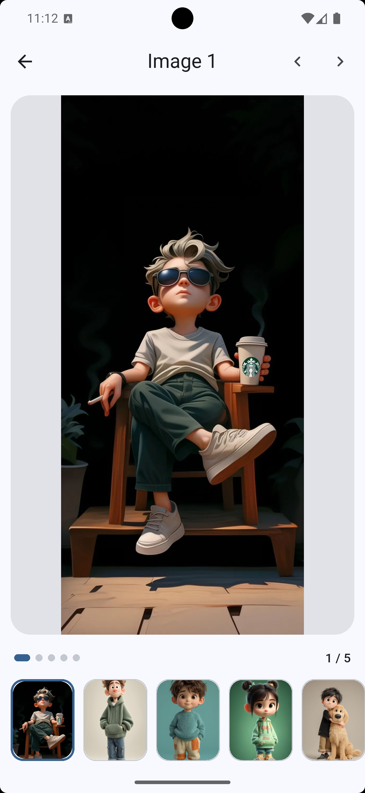
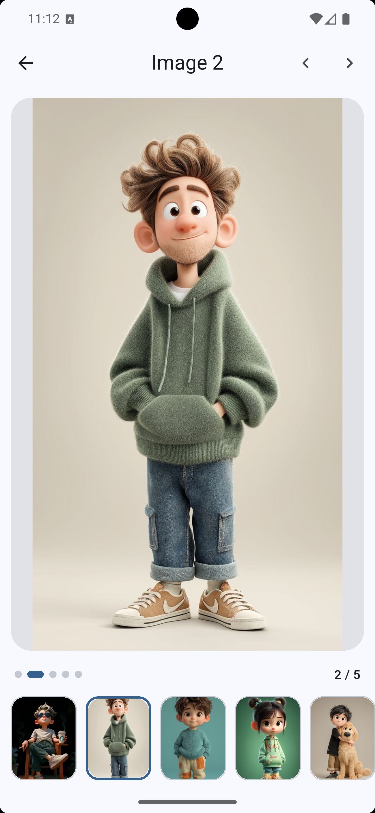
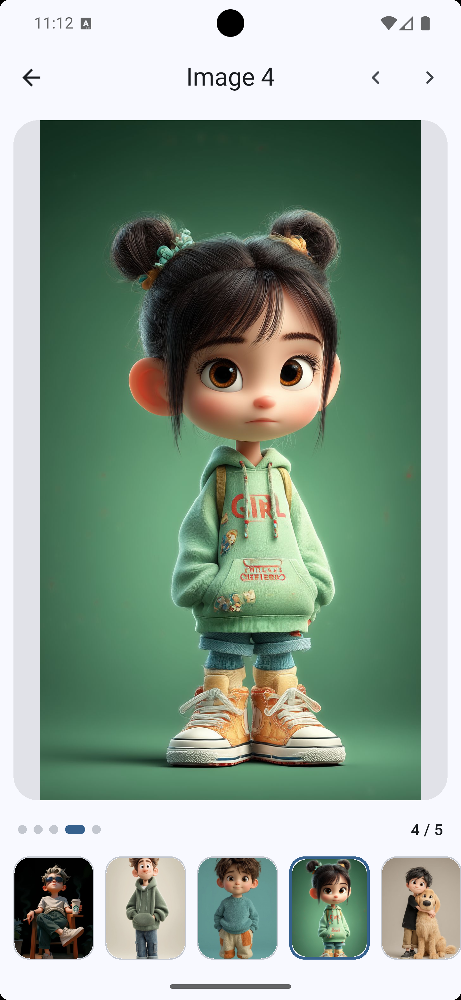
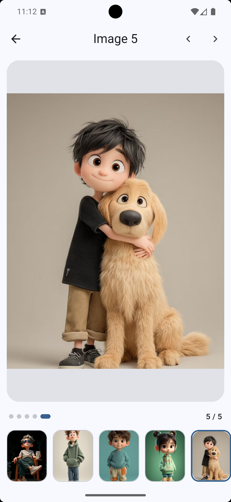

<div align="center">

# Image Viewer App

A modern Flutter app for browsing local image assets in a gallery and full-screen swipe viewer.

[](https://flutter.dev)
[](https://dart.dev)
[](LICENSE)
[](https://github.com/Khaled-shahien/Image_Viewer_App/actions)

[Download](#download) - [Features](#features) - [Architecture](#architecture) - [Getting Started](#getting-started)

</div>

---

## About

Image Viewer App is a Flutter mobile application for browsing bundled image assets with a clean gallery-first experience. It is designed for quick visual inspection, full-screen viewing, swipe navigation, pinch-to-zoom interaction, and theme-aware Material UI. The project is small, approachable, and useful as a reference for feature-first Flutter organization.

## Features

| Feature | Description |
|---------|-------------|
| Gallery grid | Displays local asset images in a responsive two-column grid. |
| Full-screen viewer | Opens selected images in a swipeable PageView experience. |
| Pinch to zoom | Uses Flutter's InteractiveViewer for close inspection. |
| Thumbnail rail | Shows selectable thumbnails while viewing images. |
| Pagination indicator | Displays the active image with dots and a numeric counter. |
| Hero transitions | Animates movement from gallery tiles into the viewer. |
| Theme support | Uses light and dark Material themes based on system settings. |
| Missing image UI | Provides graceful placeholders when an asset cannot be loaded. |

## Architecture

The app uses a feature-first Flutter structure with shared core modules and a focused gallery feature. The current implementation is presentation-led because the app works from local bundled assets and does not require a data or domain layer yet.

Project structure:

```text
lib/
|-- main.dart
|-- core/
|   |-- constants/
|   |   `-- image_paths.dart
|   `-- theme/
|       `-- app_theme.dart
`-- features/
    `-- gallery/
        `-- presentation/
            |-- screens/
            |   |-- gallery_screen.dart
            |   `-- viewer_screen.dart
            `-- widgets/
                |-- dots_indicator.dart
                |-- gallery_tile.dart
                `-- image_missing_full.dart
```

## Tech Stack

| Technology | Usage |
|------------|-------|
| Flutter | Cross-platform UI framework. |
| Dart | Application language and tooling. |
| Material Design | Theme, layout, navigation, icons, and UI primitives. |
| `image` | Image processing dependency declared for image-related workflows. |
| Flutter assets | Local images loaded from `assets/images/`. |
| Flutter test | Widget and regression testing. |

## Screenshots

| Gallery | Viewer | Details |
|---------|--------|---------|
|  |  |  |

| Viewer | Viewer | Viewer |
|--------|--------|--------|
|  |  |  |

## Getting Started

### Prerequisites

- Flutter SDK >= 3.0.0
- Dart SDK >= 3.0.0
- Android Studio, Xcode, VS Code, or another Flutter-ready editor

### Installation

1. Clone the repository:

   ```bash
   git clone https://github.com/Khaled-shahien/Image_Viewer_App.git
   ```

2. Navigate to the project:

   ```bash
   cd Image_Viewer_App
   ```

3. Install dependencies:

   ```bash
   flutter pub get
   ```

4. Run checks:

   ```bash
   flutter analyze --no-fatal-infos
   flutter test
   ```

5. Run the app:

   ```bash
   flutter run
   ```

### Environment Setup

This project currently runs from local bundled assets and does not require secrets for normal development. A safe template is provided in `.env.example` for future integrations. Copy it to `.env` only when you need environment-specific values:

```bash
cp .env.example .env
```

Never commit `.env` or any real credential files.

## Download

[](../../releases/latest)

## Contributing

See [CONTRIBUTING.md](CONTRIBUTING.md)

## License

This project is licensed under the MIT License - see [LICENSE](LICENSE) for details.
